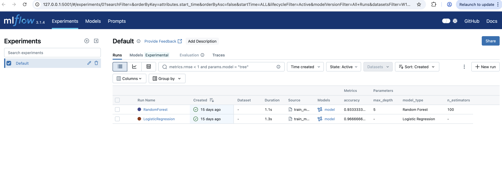

## Onboarding

```
 python -m venv venv  
 source venv/bin/activate

pip install -r requirements.txt

 uvicorn src.api.main:app --reload 

```

 API

```
 http://127.0.0.1:8000/docs

 http://127.0.0.1:8000/predict

 Example :
 curl -X 'POST' \
  'http://127.0.0.1:8000/predict' \
  -H 'accept: application/json' \
  -H 'Content-Type: application/json' \
  -d '{
  "sepal_length": 5,
  "sepal_width": 0,
  "petal_length": 0,
  "petal_width": 0
}'

Response :  setosa
```

MLRuns

```
mlflow ui --backend-store-uri ./mlruns --port 5001
```

